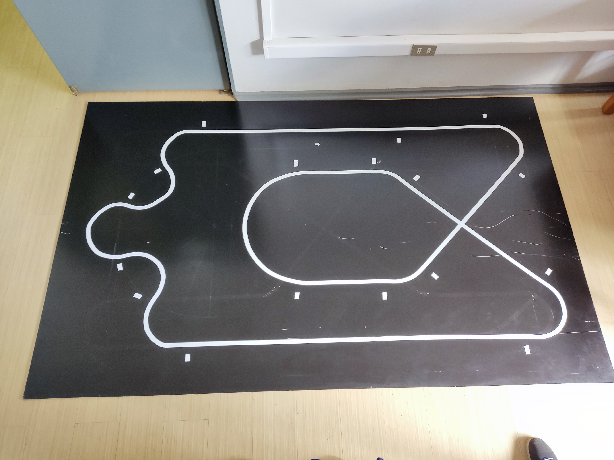

# 🏎 HermesMustakis
Este repositorio de códigos está pensado para ser una referencia del Club Velocistas de Mustakis, está pensado para el robot hermes de la fundación Mustakis, basado en el mítico robot [OpenLamborghino](https://lamborghino.com/) basado en el código de [Andres Bercovich](https://github.com/AndresBercovich/OpenLamborghino).

## ¿Cómo usar el código?
- Descargalo completo como zip con:
```git clone https://github.com/Madac1/HermesMustakis```.
- Descomprime el archivo.
- Dirigete a:
  ```cd ./HermesMustakis-main/Hermes_PID_GEO/ ```.
- Abre el archivo ```./Hermes_PID_GEO.ino``` con Arduino.

## ¿Qué debo modificar?
Modifica los valores de Kp, Ki y Kd para que se ajusten a las necesidades de tu robot.

## Recursos útiles.
- [Controlling Self Driving Cars (Controlando autos autónomos)](https://youtu.be/4Y7zG48uHRo?si=jcuBtaYHXxSWVDXW).
- [Videos de OpenLamborghino](https://www.youtube.com/@Lamborghino/videos).